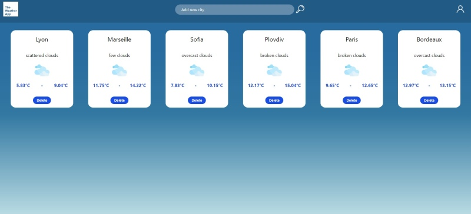

# Weatherapp-Frontend

[Link to Vercel deployment](https://weatherapp-frontend-iota.vercel.app/)

Weatherapp is a simple one-page application developped in duration of 4 days as part of the fullstack web development bootcamp in La Capsule (Lyon, 2023). 

This repository is the backend of the application.  
[Link to the frontend github repository](https://github.com/asseniliev/Weatherapp-frontend)

Front page:

Functionality available:
1. Display card with meteo info per city
2. At application load, the database is checked and current meteo info if displayed for the cities already in the database
3. New cities can be added in the meteo dashboard via the input field 'Add new city'
  (Only valid cities can be added. The app checks if the city entered exist or not)
4. Each card contains a 'Delete' button. Pressing that button permanently deletes the corresponding city
5. All cities names on the panel are stored in Mongo database

Skills trained and exercised:
1. Deploy backend using Express framework
2. Implement database schemas and use them to realize database models
3. Call backend routes and receive backend data
4. Use database CRUD operations to work with models and update documents/collections in the Mongo database
5. Fetch data from external API and return json result
6. Work with DOM events and DOM content; dynamically update the DOM